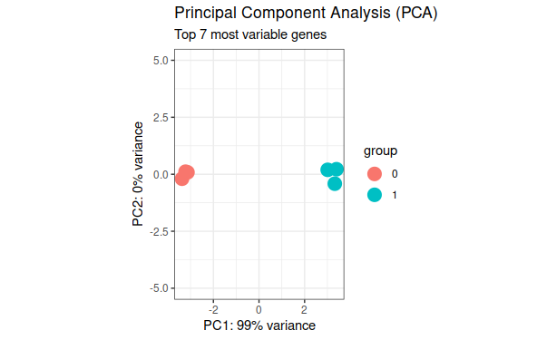
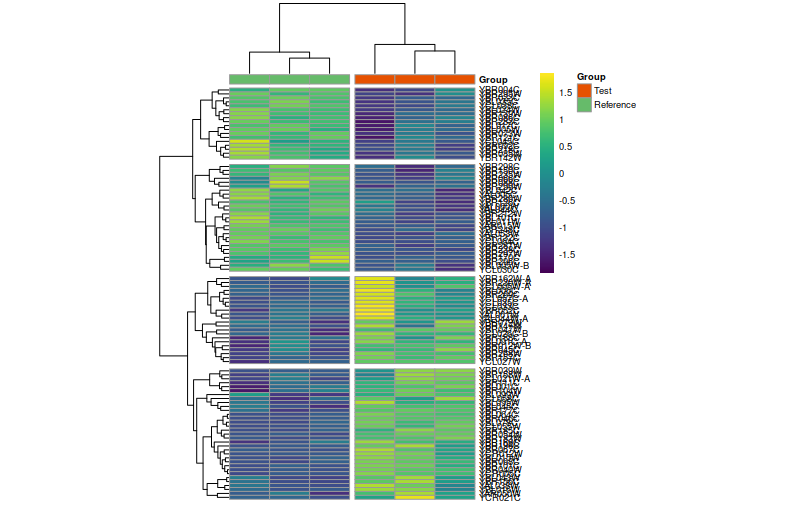
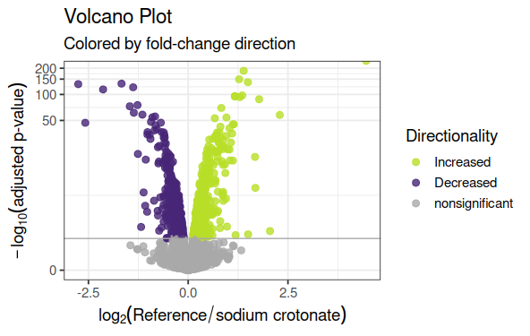
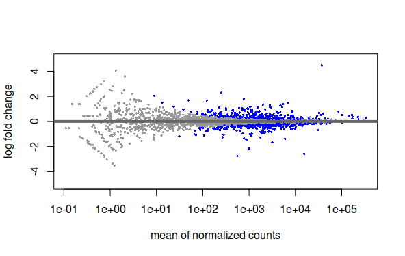
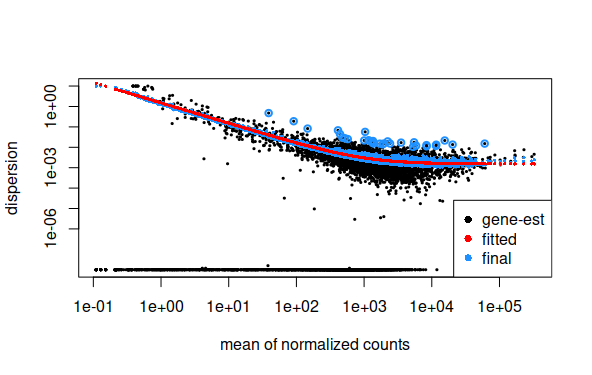

## Estadísticas de Genes significativos 
 
``` r
library(dplyr)
library(pheatmap)
library(DESeq2)
library(ggplot2)
library(viridisLite)
library(viridis)
```

### Plot de PCA (Principal Component Analisis)
``` r
# Convert all samples to rlog
ddsMat_rlog <- rlog(ddsMat, blind = FALSE)

# Plot PCA by column variable
plotPCA(ddsMat_rlog, intgroup = "Group", ntop = 40) +
  theme_bw() + # remove default ggplot2 theme
  geom_point(size = 5) + # Increase point size
  scale_y_continuous(limits = c(-5, 5)) + # change limits to fix figure dimensions
  #scale_color_brewer(palette = "Dark2")+  
  ggtitle(label = "Principal Component Analysis (PCA)", 
          subtitle = "Top 40 most variable genes") 
```




### Heatmap de pricipales genes expresados diferencialmente
```r
results_sig <- subset(results, padj < 0.05)
results_sig


ddsMat_rlog <- rlog(ddsMat, blind = TRUE)
ddsMat_rlog
mat <- assay(ddsMat_rlog[row.names(results_sig)])[1:100, ]

annotation_col = data.frame(
  Group = colData(ddsMat_rlog)$Group, 
  row.names = colData(ddsMat_rlog)$SampleID
)
annotation_col$Group <- as.character(annotation_col$Group)

annotation_col$Group[annotation_col$Group == "1"] <- "Test"
annotation_col$Group[annotation_col$Group == "0"] <- "Reference"

ann_colors = list(
  Group = c("Test" = "#E65100", "Reference" = "#66BB6A"),
  SampleID= c(a = "red")
)

library(pheatmap)
pheatmap(mat = mat, 
         color = viridis(180), 
         scale = "row", # Scale genes to Z-score (how many standard deviations)
         annotation_col = annotation_col, # Add multiple annotations to the samples
         annotation_colors = ann_colors,# Change the default colors of the annotations
         fontsize = 7, # Make fonts smaller
         cellwidth = 30, # Make the cells wider
         cutree_cols = 2,
         cutree_rows = 4,
         show_colnames = F)


pheatmap(mat = mat, 
         color = viridis(180), 
         scale = "row", # Scale genes to Z-score (how many standard deviations)
         annotation_col = annotation_col, # Add multiple annotations to the samples
         annotation_colors = ann_colors,# Change the default colors of the annotations
         fontsize = 7, # Make fonts smaller
         cellwidth = 30, # Make the cells wider
         cutree_cols = 3,
         cutree_rows = 4,
         cluster_cols = F,
         show_colnames = F)
```



### Volcan Plot de genes expresados diferencialmente 
```r

data_vp <- data.frame(gene = row.names(results),
                      pval = -log10(results$padj), 
                      lfc = results$log2FoldChange)

# Remove any rows that have NA as an entry
data_vp <- na.omit(data_vp)
library(dplyr)

# Color the points which are up or down
## If fold-change > 0 and pvalue > 1.3 (Increased significant)
## If fold-change < 0 and pvalue > 1.3 (Decreased significant)
data_vp <- mutate(data_vp, color = case_when(data_vp$lfc > 0 & data_vp$pval > 1.3 ~ "Increased",
                                             data_vp$lfc < 0 & data_vp$pval > 1.3 ~ "Decreased",
                                             data_vp$pval < 1.3 ~ "nonsignificant"))

# Make a basic ggplot2 object with x-y values
vol <- ggplot(data_vp, aes(x = lfc, y = pval, color = color))

# Add ggplot2 layers
vol +   
  ggtitle(label = "Volcano Plot", subtitle = "Colored by fold-change direction") +
  geom_point(size = 2.5, alpha = 0.8, na.rm = T) +
  scale_color_manual(name = "Directionality",
                     values = c(Increased = "#B8DE29FF", Decreased = "#482677FF", nonsignificant = "darkgray")) +
  theme_bw(base_size = 14) + # change overall theme
  theme(legend.position = "right") + # change the legend
  xlab(expression(log[2]("Reference" / "sodium crotonate"))) + # Change X-Axis label
  ylab(expression(-log[10]("adjusted p-value"))) + # Change Y-Axis label
  geom_hline(yintercept = 1.3, colour = "darkgrey") + # Add p-adj value cutoff line
  scale_y_continuous(trans = "log1p") # Scale yaxis due to large p-v
```




### Plot de Dispersion de datos ajustados a modelo de regresión

```r

plotMA(results, ylim = c(-5, 5))
plotDispEsts(ddsMat)


```







### Análisis de genes especificos 

```r
# Convert all samples to rlog
ddsMat_rlog <- rlog(ddsMat, blind = FALSE)

# Get gene with highest expression
top_gene <- rownames(results)[which.min(results$log2FoldChange)]

# Plot single gene
plotCounts(dds = ddsMat, 
           gene = top_gene, 
           intgroup = "Group", 
           normalized = T, 
           transform = T)
```
