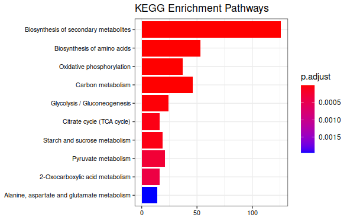

## Enrriquecimiendo de vias metabolicas

 
``` r
library(DESeq2)
library(org.Sc.sgd.db)
library(GO.db)
library(KEGGgraph)
library(clusterProfiler)
library(pathview)
```


### Anotacion de genes segun bases de datos
```r
columns(org.Sc.sgd.db)
keytypes(org.Sc.sgd.db)

results_sig <- subset(results, padj < 0.05)


results_sig$genename <-  AnnotationDbi::select(org.Sc.sgd.db, keys = row.names(results_sig),
                                              columns = 'GENENAME', 
                                              keytypes = 'ALIAS')


results_sig$symbol <- row.names(results_sig)

results_sig$entrez <- AnnotationDbi::select(org.Sc.sgd.db, keys = row.names(results_sig),
                                        columns = 'ENTREZID', 
                                        keytypes = 'ALIAS')


results_sig$ORF <- AnnotationDbi::select(org.Sc.sgd.db, keys = row.names(results_sig),'ORF','ALIAS', multiVals = "list")

#results_sig$GO <- AnnotationDbi::select(org.Sc.sgd.db, keys = row.names(results_sig),"GOALL","ALIAS", multiVals = "list")


results_sig$GO <- mapIds(org.Sc.sgd.db, keys = row.names(results_sig),'GOALL','ORF')


```
### Enrriquecimiento de GO (gene ontology)

```r
columns(GO.db)
keytypes(GO.db)
enrich <- AnnotationDbi::select(GO.db, keys = results_sig$GO, columns = c('TERM', 'ONTOLOGY'), keytypes = 'GO')
enrich$symbol <- results_sig$symbol
enrich

enrich2 <- AnnotationDbi::select(GO.db, keys = results_sig$GO, columns = 'DEFINITION', keytypes = 'GO')
enrich2$symbol <- results_sig$symbol
enrich2

results_sig_entrez <- subset(results_sig, is.na(GO) == FALSE)

data <- enrich %>% group_by(ONTOLOGY) %>% summarise(N = n())
barplot(data$N)
# Create a matrix of gene log2 fold changes
# View the format of the gene matrix
##- Names = ENTREZ ID
##- Values = Log2 Fold changes
results_sig_entrez

gene_matrix <- results_sig_entrez$log2FoldChange
rownames(results_sig_entrez)
names(gene_matrix) <- results_sig_entrez$entrez$ENTREZID

```
### Enrriquecimiento de KEGG

```r
enrichKEeeGG <- enrichKEGG(gene = rownames(results_sig_entrez),
           organism = 'sce',
           pvalueCutoff = 0.05, 
           qvalueCutoff = 0.10)


barplot(enrichKEeeGG, 
        drop = TRUE, 
        showCategory = 10, 
        title = "KEGG Enrichment Pathways",
        font.size = 8)
```





### Plot de Pricipales vias metabolicas afectadas

```r
pathview(gene.data = gene_matrix,
         pathway.id = "00010", 
         species = "sce")
```

